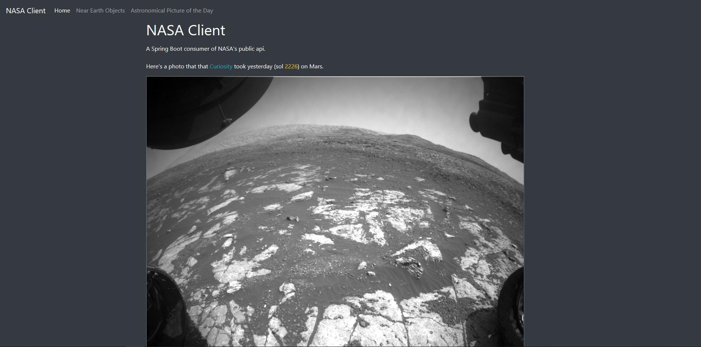
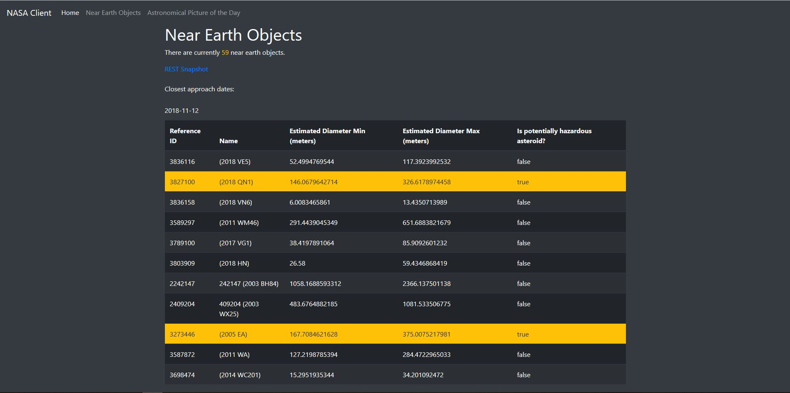

# NASA Client
A Spring Boot consumer of NASA's public api.

The application is hosted at: https://nasaclient.herokuapp.com/

* The home page displays a picture taken by the Curiosity rover from the day before. 
* The Near Earth Objects page shows how many near Earth objects there are with the potentially hazardous ones highlighted in yellow. There is also REST snapshot link to see the json data. 
* There is a page to see the Astronomical Picture of the Day with a small explanation written by an astronomer.

My goal is to contribute to this application over time and make it something truly special. I'm using it as a means to learn more about the spring boot framework while building something interesting!
